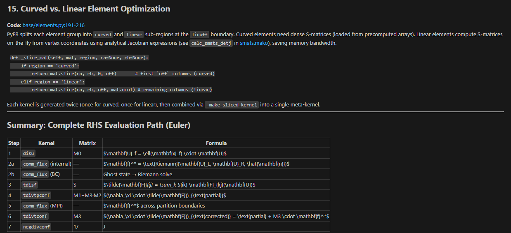
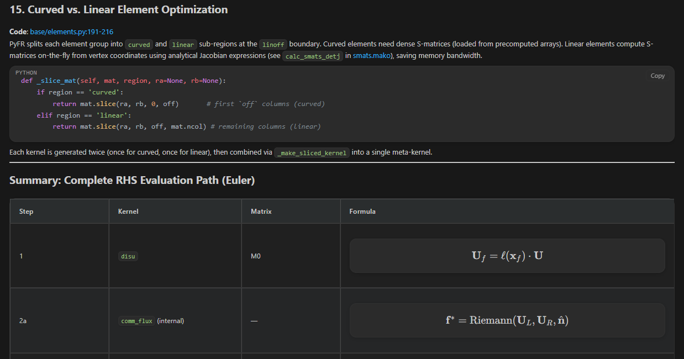

# Claude Code Enhance

Claude Code Enhance is a local VS Code extension that improves the Claude Code chat webview.

Based on work from:
- [claude-code-enhance](https://github.com/Sophomoresty/claude-code-enhance)
- [claude-code-katex](https://github.com/MahammadNuriyev62/claude-code-katex)

It adds:

- LaTeX math rendering with KaTeX
- Syntax highlighting for code blocks
- Theme-aware output styling for light, dark, and high-contrast themes
- More readable prompt/input text
- Copy buttons for assistant output and individual code blocks
- Table and code-block readability improvements
- Ctrl/Cmd + mouse-wheel zoom for the chat output

## Preview

Original Claude Code output:



Enhanced output with Claude Code Enhance:



## Usage Guide

### LaTeX Math Rendering

The extension renders LaTeX math in Claude Code's responses using KaTeX. Four delimiter styles are supported:

| Delimiter | Mode | Example |
|---|---|---|
| `$...$` | Inline math | `The gradient $\nabla f(x)$ is computed via autodiff.` |
| `$$...$$` | Display math | `$$\int_0^\infty e^{-x^2} dx = \frac{\sqrt{\pi}}{2}$$` |
| `\(...\)` | Inline math | `The matrix \(A \in \mathbb{R}^{m \times n}\) has rank \(r\).` |
| `\[...\]` | Display math | `\[\mathbf{n}_{\text{phys}} = \mathbf{S}^T \cdot \mathbf{n}_{\text{ref}}\]` |

**Display math** renders as a centered, full-width block with a themed background and larger font size (1.6em). **Inline math** renders within the text flow at 1.1em with subtle background shading and rounded corners.

**Smart math detection** — the enhancer uses heuristics to avoid rendering prose text as math. It detects CJK characters, prose punctuation, word density, and markdown emphasis patterns to decide whether a `$...$` span is actually LaTeX. False positives (KaTeX error spans in prose) are automatically cleaned up.

**Standalone math promotion** — when an inline math expression is the only content on its line (or the only content in its paragraph), it is automatically promoted to display math with the full block treatment.

**Large inline math** — inline expressions containing matrices (`\begin{matrix}`), fractions (`\frac`), or square roots (`\sqrt`) that exceed 34px in height or 58% of container width get a special `ce-large-inline-math` class with expanded padding and horizontal scroll.

**LaTeX in HTML** — when Claude Code's markdown parser splits math expressions with HTML tags (e.g., `$a_<em>i</em>$`), the enhancer repairs these by linearizing the DOM and restoring the original LaTeX before rendering.

**Escaped delimiters** — delimiters preceded by an odd number of backslashes (e.g. `\$not math\$`) are left as literal text.

Math inside inline code (`` `...` ``) and fenced code blocks is left as literal text.

### Syntax Highlighting

Code blocks are highlighted with bundled Highlight.js with a custom One Dark / One Light inspired syntax palette:

- **Labeled fences** — `` ```python ``, `` ```typescript ``, `` ```bash ``, `` ```latex `` and more are highlighted with language-specific grammar. Aliases are recognized: `js`→javascript, `ts`→typescript, `py`→python, `sh/bash/shell/zsh`→bash, `yml`→yaml, `md`→markdown, `tex`→latex.
- **Unlabeled fences** — blocks without a language tag default to `markdown` highlighting with colored prose, stronger heading colors, and distinct link/code/list-marker styles. This avoids the random auto-detection problem where unlabeled code gets guessed as `java`, `css`, `ini`, etc.
- **Unsupported languages** — blocks with languages Highlight.js does not recognize fall back to plain text styling with a language label instead of throwing errors.

The syntax palette maps 14 semantic token types (keywords, strings, numbers, comments, types, functions, etc.) to theme-aware CSS variables that adapt automatically across light, dark, and high-contrast themes.

### Copy Buttons

Two types of copy buttons are added:

**Per-code-block copy** — each `<pre>` block gets a **Copy** button at the top-right corner. Click copies the code block's raw text content. The button shows "Copied" for 1.4 seconds on success, or "Failed" on error.

**Per-turn copy** — each assistant message turn gets a **Copy** button at the bottom-right corner (visible on hover). Click copies the entire conversation turn as Markdown:
- KaTeX expressions are converted back to `$...$` or `$$...$$` delimited LaTeX
- Headings, lists, tables, code blocks, links, blockquotes are preserved as proper Markdown
- **Thinking content** (reasoning blocks) and **tool use/results** are excluded from the copy
- User messages are excluded from the copy

### Zoom

Hold **Ctrl** (or **Cmd** on macOS) and scroll with the mouse wheel to zoom the chat output:

- **Zoom range**: 0.5× to 2.0× in 0.1× increments
- A temporary zoom indicator appears in the center of the screen showing the current level (fades out after 1 second)
- Zoom level is persisted in `localStorage` under the key `claude-zoom` and survives webview reloads
- Zoom affects only the chat output (enhancement roots), not the entire webview or the chat input

### Relaxed Bold Rendering

Claude Code's Markdown parser follows CommonMark, which does not recognize bold markers with inner spaces: `** bold text **` appears as literal asterisks. The enhancer detects and renders these as `<strong>` elements. This only applies within prose text — code blocks, math expressions, and the chat input are left unchanged.

### Table Styling

Tables receive theme-aware styling:
- Full-width layout with 0.95em font size
- Rounded corners (12px border-radius)
- Themed background with subtle shadow
- Header row with distinct background color
- Zebra striping on alternating rows
- Row hover highlight
- Thin themed scrollbar for overflow tables
- Code within table cells is styled consistently

### Input & Prompt Readability

The enhancer forces VS Code theme colors on the chat input and textarea elements, ensuring:
- Input text color matches VS Code editor foreground
- Placeholder text matches VS Code placeholder foreground
- Caret color matches VS Code editor cursor color
- Text fill color is explicitly set to prevent CSS specificity issues

### Rich Editor Protection

The chat composer uses `contenteditable` and `[role="textbox"]` elements. The enhancer explicitly resets all code block styling on these elements (borders, padding, background, whitespace) so preview styles do not leak into the editing surface.

### Status Bar Indicator

A status bar item (right-aligned) shows the current state:

| Indicator | Meaning |
|---|---|
| `LaTeX` (with operator symbol) | Enhancement patch is active |
| `LaTeX (off)` | Patch is not applied |
| `LaTeX (no CC)` | Claude Code extension is not installed |

Click the status bar item to run the status command, which reports the current patch state in detail.

### DOM Inspector (Hidden Debug Tool)

Press **Ctrl+Shift+D** inside the Claude Code webview to dump the DOM structure to your clipboard as JSON. This includes:
- All unique class names in the document
- Elements matching 14 message-related selector patterns
- Root element structure analysis (up to 4 levels deep)
- Text-containing containers (> 200 characters)
- A green "Copied" notification confirms success

## Version

Current local version: `1.0.0`

The package version is intentionally kept at `1.0.0` for now. Internal patch revisions are tracked separately inside the patched webview so a rebuilt `1.0.0` VSIX can still refresh stale injected code.

## Requirements

- VS Code or code-server
- The official `anthropic.claude-code` extension installed
- This VSIX installed from the local build output

## Install

From this directory:

```bash
npm run package
code --install-extension claude-code-enhance-1.0.0.vsix --force
```

Reload VS Code after installing. The extension patches Claude Code automatically on startup and reloads the Claude Code webview when it applies or refreshes the patch.

## Commands

Open the command palette with `Ctrl+Shift+P`:

- `Claude Code Enhance: Enable`
- `Claude Code Enhance: Disable`
- `Claude Code Enhance: Status`

## What Gets Patched

Claude Code Enhance does not modify Claude Code's extension host code. It patches only Claude Code's webview files:

- `webview/index.js`
- `webview/index.css`

Before patching, it creates backups:

- `webview/index.js.katex-bak`
- `webview/index.css.katex-bak`

The patch is version-stamped. When this extension updates, it can restore the original files from backup and re-apply the current patch.

## How Rendering Works

The extension injects `remark-math` and `rehype-katex` into Claude Code's Markdown rendering pipeline. Math is parsed before Markdown emphasis and escaping can damage LaTeX, so expressions like these render correctly:

```tex
$\mathbf{n}_{\text{phys}} = \mathbf{S}^T \cdot \mathbf{n}_{\text{ref}}$
$J^{-1} = S/|J|$
$$\tilde{F}_{ij} = \sum_k S^{\xi_i}_k \cdot F_{kj}$$
```

The bundled `enhance.js` also runs inside the webview to improve output styling, copy behavior, zoom, tables, code blocks, and fallback math rendering.

## Theme Behavior

The enhancer uses VS Code theme variables where possible:

- editor foreground/background
- input foreground/background
- widget borders
- text code block background
- inline and display math background
- button colors
- high-contrast borders

Light theme code blocks use the One Light inspired palette so the dark bundled syntax theme does not produce low-contrast text.

## Disable Or Uninstall

Preferred temporary disable:

1. Run `Ctrl+Shift+P`.
2. Select `Claude Code Enhance: Disable`.
3. The extension restores the original webview files and reloads the webview.

To re-enable, run:

```text
Claude Code Enhance: Enable
```

Uninstalling the VS Code extension should run `uninstall-hook.js`, which restores the backups and removes copied KaTeX fonts.

## If You Disabled The Extension From The Extensions Panel

VS Code's extension disable action does not run cleanup hooks. If you disabled the extension from the Extensions panel before running `Claude Code Enhance: Disable`, the already-patched Claude Code webview may keep the enhancement.

Use one of these fixes:

1. Re-enable `Claude Code Enhance`, then run `Claude Code Enhance: Disable`.
2. Or run the restore hook manually from this source directory:

```bash
npm run restore
```

Then reload the Claude Code webview or reload the VS Code window.

## Development

Run the dependency-free smoke test:

```bash
npm test
```

Build a VSIX:

```bash
npm run package
```

The generated `.vsix` file is ignored by `.vscodeignore`, so rebuilding will not accidentally include an old VSIX inside a new VSIX.

## Important Notes

- Disable or uninstall older `claude-code-katex` builds before using this extension to avoid two patchers fighting over the same Claude Code webview files.
- If Claude Code changes its internal webview bundle, the patch may become unsupported. In that case the extension leaves Claude Code untouched and shows a warning.
- This is a local enhancement extension, not an official Anthropic extension.

## License

MIT — see [LICENSE](LICENSE)